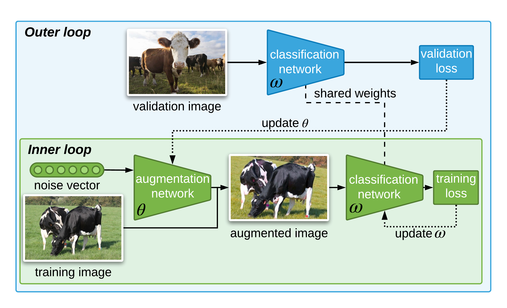
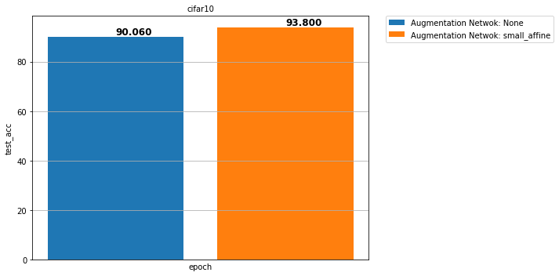

[](https://opensource.org/licenses/Apache-2.0)


# DABO: Data Augmentation with Bilevel Optimization  [[Paper]](https://arxiv.org/pdf/2006.14699.pdf)
The goal is to automatically learn an efficient data augmentation regime for image classification.


## Table of Contents

- [Overview](#overview)
- [Experiments](#experiments)
- [Citation](#citation)

## Overview

<b>What's new:</b> This method provides a way to automatically learn data augmentation in order to improve the image classification performance. It does not require us to hard code augmentation techniques, which might need domain knowledge or an expensive hyper-parameter search on the validation set.

<b>Key insight:</b> Our method efficiently trains a network that performs data augmentation. This network learns data augmentation by usiing the gradient that flows from computing the classifier's validation loss using an online version of bilevel optimization. We also perform truncated back-propagation in order to significantly reduce the computational cost of bilevel optimization.

<b>How it works:</b> Our method jointly trains a classifier and an augmentation network through the following steps,




* For each mini batch,a forward pass is made to calculate the training loss.
* Based on the training loss and the gradient of the training loss, an optimization step is made for the classifier in the inner loop.
* A forward pass is then made on the classifier with the new weight to calculate the validation loss.
* The gradient from the validation loss is backpropagated to train the augmentation network.

<b>Results:</b> Our model obtains better results than carefuly hand engineered transformations and GAN-based approaches. Further, the results are competitive against methods that use a policy search on CIFAR10, CIFAR100, BACH, Tiny-Imagenet and Imagenet datasets.

<b>Why it matters:</b> Proper data augmentation can significantly improve generalization performance. Unfortunately, deriving these augmentations require domain expertise or extensive hyper-parameter search. Thus, having an automatic and quick way of identifying efficient data augmentation has a big impact in obtaining better models.

<b>Where to go from here:</b> Performance can be improved by extending the set of learned transformations to non-differentiable transformations. The estimation of the validation loss could also be improved by exploring more the influence of the number of iteration in the inner loop. Finally, the method can be extended to other tasks like object detection of image segmentation.


## Experiments

<b>1. Install requirements:</b> Run this command to install the Haven library which helps in managing experiments.

```
pip install -r requirements.txt
``` 


<b>2.1 CIFAR10 experiments:</b> The followng command runs the training and validation loop for CIFAR.

```
python trainval.py -e cifar -sb ../results -d ../data -r 1
```

where `-e` defines the experiment group, `-sb` is the result directory, and `-d` is the dataset directory.

<b>2.2 BACH experiments:</b> The followng command runs the training and validation loop on BACH dataset.

```
python trainval.py -e bach -sb ../results -d ../data -r 1
```

where `-e` defines the experiment group, `-sb` is the result directory, and `-d` is the dataset directory.


<b>3. Results:</b> Display the results by following the steps below,



Launch Jupyter by running the following on terminal,

```
jupyter nbextension enable --py widgetsnbextension
jupyter notebook
```

Then, run the following script on a Jupyter cell,
```python
from haven import haven_jupyter as hj
from haven import haven_results as hr
from haven import haven_utils as hu

# path to where the experiments got saved
savedir_base = '<savedir_base>'
exp_list = None

# exp_list = hu.load_py(<exp_config_name>).EXP_GROUPS[<exp_group>]
# get experiments
rm = hr.ResultManager(exp_list=exp_list, 
                      savedir_base=savedir_base, 
                      verbose=0
                     )
y_metrics = ['test_acc']
bar_agg = 'max'
mode = 'bar'
legend_list = ['model.netA.name']
title_list = 'dataset.name'
legend_format = 'Augmentation Netwok: {}'
filterby_list = {'dataset':{'name':'cifar10'}, 'model':{'netC':{'name':'resnet18_meta_2'}}}

# launch dashboard
hj.get_dashboard(rm, vars(), wide_display=True)
```


## Citation

```
@article{mounsaveng2020learning,
  title={Learning Data Augmentation with Online Bilevel Optimization for Image Classification},
  author={Mounsaveng, Saypraseuth and Laradji, Issam and Ayed, Ismail Ben and Vazquez, David and Pedersoli, Marco},
  journal={arXiv preprint arXiv:2006.14699},
  year={2020}
}
```
